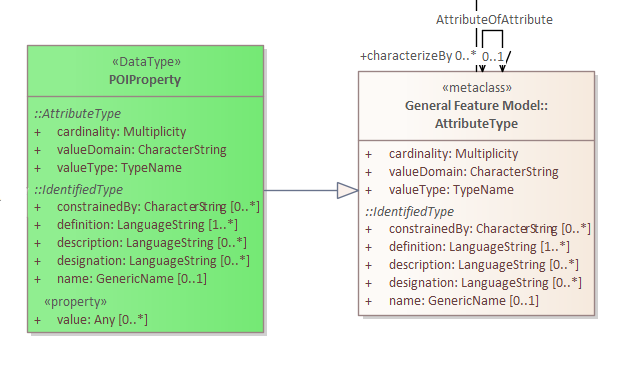

[[ug_nonstandard_attributes_section]]
== Nonstandard Attributes

An _attribute_ is a named property of a feature. While this POI Conceptual Model Standard specifies some standard attributes (e.g., lifetime attributes), most applications will need to define and use some attributes that are not normatively defined by the standard. This section discusses some strategies for doing this.

There are two main ways to include nonstandard attributes:

1. Use this standard's *POIProperty* class to construct properties, which can than be associated with *POI* class instances using the *hasProperty* association.

2. Extend the schema in the implementation technology (JSON, XML, etc.) to allow for the needed types.

The rest of this section will explore these alternatives.

=== Using POIProperty

The UML for a POIProperty looks like this:

What this means is that a _value_ of type POIProperty is self describing: it has attributes that describe the type and usage of the value, as well as the actual value for this instance. In more detail, these are the fields of a POIProperty and how to use them:

name:: If this value has a name, what is it? It is optional and not usually needed for the nonstandard attributes that this section is about.

definition:: What is the a concise definition of this property? One definition is mandatory; additional definitions might be provided in multiple langauges.

designation:: What additional natural language designation is needed, to complement *name*? This is optional and not usually needed. Multiple designations can support multiple languages.

description:: What is a description of the this property, including information beyond the concise definition but which may assist in understanding its scope and application. Descriptions are optional, with multiple descriptions allowed to support different languages.

constrainedBy:: What constraints are made on this type to ensure integrity of data? As an example, a constraint might specify acceptable combinations of attribute values in one or more feeature instances. This can be a natural language string or something expressed in a formal constraint language. Constraints are optional.

cardinality:: How many items can be in the value of one instance of this property? The *cardinality* is a *Multiplicity*, which a range of numbers. It can be a single number (e.g., `1`), an inclusive range of numbers (e.g., `0..2`), or an infinite range of numbers with a minimum (e.g., `1..*`).

valueDomain:: What is the underlying domain used to express values? Examples are `"text"` or `"real"`. _TODO What are the valid things to put into this field?_

valueType:: What is the name of the type of this property? A valueType is a TypeName, which is defined as "a LocalName that references either a recordType or object type in some form of schema." So, when you implement the conceptual model in a particular implementation technology, this valueType needs to refer to some type defined in that schema. For example, an JSON example schema for this standard includes types such as CI_Telephone, CI_Address, etc., that could be used here.

value:: The actual value of the property. It might be empty, a single value, or multiple values, depending on the *cardinality* of this property. The type of the values is give by the *valueType*.

For example, suppose an application needed an attribute called *isPublic*, whose value is true or false depending on whether or not the POI is something the general public can visit. A particular POI could include a *hasProperty* association to a set of values, one of which would include:

....
   POIProperty
      definition: "True if a POI is publicly visitible."
      cardinality: 1
      valueDomain: "boolean"
      valueType: Boolean
      value: true
....

As another example, a phone number may be needed for some POIs. The _Annex B (Informative) ISO Data Dictionary_ of the POI-CM standard describes a number of DataTypes that should be used if they capture the meaning of a needed but nonstandard attribute. The Annex describes a *CI_Telephone* class, with these fields:

[cols="1,2,3"]
|===
|*Attribute*|*Value type and multiplicity*|*Definition*

|number
|CharacterString [1..1]
|telephone number by which individuals can contact responsible organisation or individual

|numberType
|CI_TelephoneTypeCode [0..1]
|type of telephone responsible organisation or individual
|===

The *CI_TelephoneTypeCode* can be one of `facsimile`, `sms`, or `voice`.

So one could use a POIProperty like this for a phone number:

....
   POIProperty
      definition: "Telephone number by which individuals can contact responsible the POI."
      cardinality: 1
      valueDomain: "text"
      valueType: CI_Telephone
      value:
         CI_Telephone
            number: "+1 555 555-5555"
            numberType: voice
....

Besides *CI_Telephone*, some other types in the informative Annex that might often appear as nonstandard attributes are:

[none]
* Date, Time, Decimal, Integer, Number, Real, Vector, CharacterString, URI, Boolean, DateTime, CI_Address, CI_Contact, CI_Date, CI_OnlineResource, CI_Organisation, MD_Identification, MD_Keywords, 

The above examples showed the values in an implementation-agnostic form. In any particular use of this standard, an implementation technology will be chosen to serialize POI values. Accompanying this User Guide is an example *POI Schema3.json* schema that specifies how to serialize POIs as JSON objects. Using that schema, a POI with a telephone number and a public visibility flag would be serialized as follows:

....
   {
      "type": "Feature",
      "geometry": {"type": "Point", "coordinates": {45.14, -94.69}},
      "properties": {
         "featureID": 693842,
         "name": {"name" : "Midtown Library"},
         "contactInfo" : {"role": "city representative"},
         "hasFeatureOfInterest": {"href": ""},
         "hasProperty" : [
            {
               "definition": "Telephone number by which individuals can contact responsible the POI.",
               "cardinality": 1,
               "valueDomain": "text",
               "valueType": "CI_Telephone",
               "value": {"number": "+1 555 555-5555"}
            },
            {
               "definition": "True if a POI is publicly visitible.",
               "cardinality": 1,
               "valueDomain": "boolean",
               "valueType": "Boolean",
               "value": true,
            }
         ]
      }
   }
....

Note that while this works out of the box with standard schemas, it leads to very verbose representations of attribute values in POI instances.

=== Extending the Implementation Schema

A second approach to dealing with nonstandard attributes is to extend the schema used to implement the POI-CM in a particular implementation technology.

As a concrete example, suppose JSON is the implementation technology. Part of the supplied example JSON schema for this standard is:

....
    "POI": {
      "type": "object",
      "id": "#PointOfInterest",
      "required": [
          "featureId",
          "contactInfo",
          "hasFeatureOfInterest"
      ],
      "properties": {
        "featureID": {"type": "number"},
        "description": {"type": "string"},
        "name": {
          "$ref": "#/properties/GenericName"        
        },
        "identifier": {
          "$ref": "#/properties/ScopedName"        
        },
        "creationDate": {
           "$ref": "#/properties/DateTime"        
        },
        "terminationDate": {
           "$ref": "#/properties/DateTime"        
        },
        "validFrom" : {
           "$ref": "#/properties/DateTime"        
        },
        "validTo": {
           "$ref": "#/properties/DateTime"        
        },
        "contactInfo": {
           "$ref": "#/properties/CI_Responsibility" 
        },
        "hasFeatureOfInterest": {
           "$ref": "#/properties/reference"  
        },
        "hasMetadata": {
           "$ref": "#/properties/reference"  
        },
        "hasProperty": {
           "$ref": "#/properties/POIProperty"  
        },
        "keywords": {
           "$ref": "#/properties/MD_Keyword"        
        },
        "constraints": {
           "$ref": "#/properties/MD_Constraints"                    
        },
        "symbology": {
           "$ref": "#/properties/reference"  
        },
        "links": {
           "$ref": "#/properties/reference"  
        }
      }
    }     
....

One could consider adding new properties to this list to represent the attributes that are needed for a specific use case that a community of interest wants to agree upon. For example, one could add

....
        "telephoneNumber": {
           "$ref": "#/properties/CI_Telephone"        
        },
....

in the above list and then a property `"telephone"` could be used directly in a POI instead of as a self-describing attribute in the *hasProperty" value of a POI. The example schema already includes a schema fragment for *CI_Telephone*, and another of other useful ones (see previous section). If you need a type that isn't already provided, that type could also be inserted into the schema.
