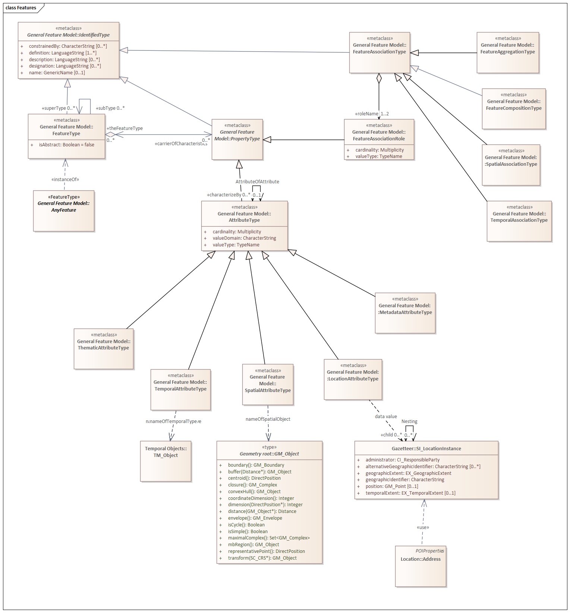

== POI

A Point of Interest (POI) is a Feature. Therefore, it is important to understand what a POI inherits from the OGC Feature model.

The OGC Feature Model is defined in ISO 19109:2015 Geographic Information - Rules for application schema. A UML model showing applicable portions of the General Feature Model is provided in <<feature_model,Figure 1>>. 

[feature_model,reftext='Feature Model']
.Feature Model

The most relevant classes defined by this model are described below:

*FeatureType:* describe

*AnyFeature:* describe

*PropertyType:* describe

*AttributeType:* describe

*SpatialAttributeType:* do we want to restrict GM_Object to just points, lines, and areas?

In this Standard we extend the General Feature Model to support the concept of a Point of Interest. 

[poi_uml_model,reftext='POI UML Model']
.POI UML Model
image::../images/POI.png[align="center"]

*AbstractFeature:* The root Feature class for this standard. This class has been borrowed from the CityGML 3.0 Conceptual Model.

*AbstractFeatureWithLifespan:* Adds temporality to AbstractFeature. This class was copied from the CityGML 3.0 Conceptual Model.

*AbstractPOI:* The abstract model for a Point of Interest. All POI instances will contain these attributes.

*POI:* A POI instance. This class inherits everything from the AbstractPOI, identifies the associated FeatureOfInterest, then adds attributes from the Feature of Interest.

*FeatureOfInterest:* This is an OGC Feature which has been defined independently from the POI. Conceptually, the purpose of the POI is to provide a user friendly syopsys of this Feature.

*FeatureModel:* The data model for the FeatureOfInterest. This class identifies and describes all of the attributes of the FeatureOfInterest.

*Mapping:* A logical mapping of attributes in the FeatureModel into associated attributes in the POI. All POI attributes must come from the AbstractPOI class or be mapped in from a FeatureOfInterest.  

Geometry

The OGC Geometry model is defined in ISO 19107:2003 - Geographic Information - Spatial schema. While there is a new version of this standard, it has not been widely implemented. So the 2003 version has been used in this Standard.

[geometry_model,reftext='Geometry Model']
.Geometry Model
image::../images/Geometry.png[align="center"]

*GM_Object:* Root class for all OGC geometries.

*GM_Point:* The geometric primitive for Points

*GM_LineString:* The geometric primitive for line strings.

*GM_Polygon:* The geometric primitive for areas.

