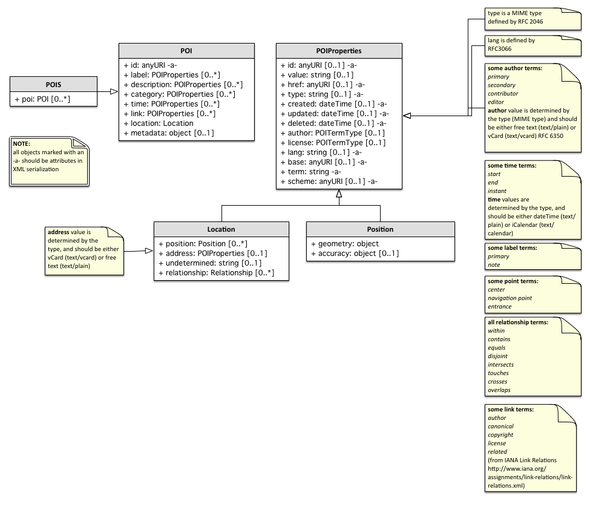

// generated with: asciidoctor --attribute docinfo --doctype book -a source-highlighter=coderay --section-numbers poi.adoc
:toc:
:toc-placement: manual

[width="100%",cols=">1",halign="right,align="right",role="titleblock"]
|=========================================
|*Open Geospatial Consortium*
|*Date:* September 21, 2013
|*External identifier of this OGC® document:* TBD
|*Internal reference number of this OGC® document:* 13-xxx
|*Version:* 1.0.0 Draft xx
|*Category:* OGC® Abstract Specification
|*Editor(s):* Raj Singh
|=========================================

[[poititle]]
= Points of Interest Conceptual Model

*Copyright notice*

Copyright © 2013 Open Geospatial Consortium
To obtain additional rights of use, visit http://www.opengeospatial.org/legal/.

http://www.w3.org/[W3C] (http://www.csail.mit.edu/[MIT], http://www.ercim.eu/[ERCIM], http://www.keio.ac.jp/[Keio]) holds copyright in the http://www.w3.org/TR/2011/WD-poi-core-20110512/[Points of Interest Core Working Draft] ("POI-WD"). As the Points of Interest Working Group closed in September, 2012, W3C has ceased work on POI-WD. Accordingly, W3C licenses the text of POI-WD, dated 12 May, 2011, to OGC royalty-free, permitting uses including reproduction, distribution, and creation of derivative works.

*Warning*

This document is not an OGC Standard. It is distributed for review and comment. It is subject to change without notice and may not be referred to as an OGC Standard.

Document type: OGC® Abstract Specification

Document subtype: Conceptual Model

Document stage: Draft

Document language: English

toc::[]

== Forward

=== Disclaimers

THIS DOCUMENT IS PROVIDED "AS IS," AND COPYRIGHT HOLDERS MAKE NO
REPRESENTATIONS OR WARRANTIES, EXPRESS OR IMPLIED, INCLUDING, BUT NOT
LIMITED TO, WARRANTIES OF MERCHANTABILITY, FITNESS FOR A PARTICULAR
PURPOSE, NON-INFRINGEMENT, OR TITLE; THAT THE CONTENTS OF THE DOCUMENT
ARE SUITABLE FOR ANY PURPOSE; NOR THAT THE IMPLEMENTATION OF SUCH
CONTENTS WILL NOT INFRINGE ANY THIRD PARTY PATENTS, COPYRIGHTS,
TRADEMARKS OR OTHER RIGHTS.

COPYRIGHT HOLDERS WILL NOT BE LIABLE FOR ANY DIRECT, INDIRECT, SPECIAL
OR CONSEQUENTIAL DAMAGES ARISING OUT OF ANY USE OF THE DOCUMENT OR THE
PERFORMANCE OR IMPLEMENTATION OF THE CONTENTS THEREOF.

The name and trademarks of copyright holders may NOT be used in
advertising or publicity pertaining to this document or its contents
without specific, written prior permission. Title to copyright in this
document will at all times remain with copyright holders.

=== Conventions

The key words "_must_", "_must not_", "_required_", "_shall_", "_shall
not_", "_should_", "_should not_", "_recommended_", "_may_", and
"_optional_" in this document are to be interpreted as described in
<<RFC2119>>.

[[terminology]]
=== Terminology

Location::
  The term location is used to refer to an identifiable geographic place
  <<ISO19112>>. Typically a location is a physically
  fixed point, typically on the surface of the Earth, though locations
  can be relative to other, non-earth centric coordinate reference
  systems. Locations can be a single point, a centroid, a minimum
  bounding rectangle, or a set of vectors. A location should be
  persistent over time and does not change. Multiple POIs _may_ share
  the same location. When a POI physically moves it is understood to
  have acquired a new location.
Points of Interest::
  Unlike the term location, the term POI is a human construct. POIs
  typically describe a location where one can find a place, product or
  service, typically identified by name rather than by address and
  characterized by type, which _may_ be used as a reference point or a
  target in a location based service request, e.g., as the destination
  of a route. For the purposes of this document, the term POI does not
  exclude the labeling, identification, and tracking of persons and
  other physical objects that have no permanent location.
Places::
  A place is also a human construct which typically has a coarse level
  of spatial granularity. Places are generally larger scale
  administrative constructs, either informally or formally defined.
  Countries, states, counties, districts, neighborhoods and postal codes
  or telephone area codes are all places. Places are also informally or
  colloquially defined, such as the Home Counties in the United Kingdom
  and the Bay Area in the United States.
  +
  Places have spatial relationships; with parents, children, adjacencies
  and contained by semantics. Places have the same attribute set as
  POIs, although often with differing interpretations based on scale;
  for example, the address of a Place or its URI might refer to the
  address of the administrative or governing body of the place.
  +
  A place typically contains multiple POIs and can also be coterminous
  with a POI. In the former case, a place, such as a city or a
  neighborhood, will contain multiple POIs. In the latter case, a place
  and a POI will occupy the same position and extent, such as in the
  case of Yellowstone National Park, which is both a Place and a POI.
  For the purposes of this document no distinction will be made between
  a place and a POI.
Coordinate::
  The term coordinate refers to one of a sequence of n numbers designating the position of a point in n-dimensional space <<ISO19111>>.
Coordinate Reference System::
  The term coordinate reference system refers to a coordinate system that is related to an object by a datum <<ISO19111>>.
Coordinate System::
  The term coordinate system refers to a set of mathematical rules for
  specifying how coordinates are to be assigned to points <<ISO19111>>.
Datum::
  The term datum refers to a parameter or set of parameters that define
  the position of the origin, the scale, and the orientation of a
  coordinate system <<ISO19111>>.
Geolocation::
  The term geolocation refers to the identification of the real world
  geographic location of an object.
Point::
  The term point refers to a 0-dimensional geometric primitive,
  representing a position <<ISO19107>>.
Position::
  The term position refers to a data type that describes a point or
  geometry potentially occupied by an object or person
  <<ISO19133>>.
Route::
  The term route refers to a sequence of links and / or partial links
  that describe a path, usually between two positions, within a network
  <<ISO19133>>.
Coordinate Set::
  The term coordinate set refers to the individual parts of a
  coordinate. This is often a simple coordinate pair of latitude and
  longitude values, but based on the coordinate system used, _may_ be
  other values, see <<coordinate_reference_systems>>.

[[introduction]]
== Introduction

This document describes a data model and XML syntax for representing information about points of interest (POI).

In the most broad terms, a "point of interest" is a location about which information of general interest is available. A POI can be as simple as a set of coordinates and an identifier, or more complex such as a three dimensional model of a building with names in various languages, information about open and closed hours, and a civic address. POI data has many uses including navigation systems, mapping, geocaching, location-based social networking games, and augmented reality browsers.

POI data has traditionally been exchanged in proprietary formats by various transport mechanisms. This specification defines a flexible, lightweight, extensible POI data model. This will enable content publishers to effectively describe and efficiently serve and exchange POI data.

To achieve these goals, this document describes a generic data model that may be instantiated in a variety of serializations, including XML, JSON and RDF. 

Here is an example of a simple POI serialized in XML:

[source,xml]
-----
<poi id="http://www.rajsingh.org/pois/45343489">
  <label term="primary">
    <value>Boston</value>
  </label>
  <description term="source" href="http://en.wikipedia.org/wiki/Boston">
    <value>Boston is the capital of and largest city in Massachusetts, and is one of the oldest
      cities in the United States. The largest city in New England, Boston is regarded as the
      unofficial "Capital of New England" for its economic and cultural impact on the entire
      New England region. The city proper had a population of 617,594 according to the 2010
      U.S. Census.
    </value>
    <author id="http://en.wikipedia.org" term="publisher" type="text/plain">
      <value>Wikipedia</value>
    </author>
  </description>
  <category term="city" scheme="http://www.usgs.gov/placetypes">
    <value>seat of a first-order administrative division</value>
  </category>
  <link term="canonical" href="http://www.rajsingh.org/pois/45343489.xml" type="text/xml" scheme="http://www.iana.org/assignments/link-relations/link-relations.xml"/>
  <link term="related" href="http://en.wikipedia.org/wiki/Boston" type="text/html" scheme="http://www.iana.org/assignments/link-relations/link-relations.xml"/>
  <link term="related" href="http://www.geonames.org/maps/google_42.358_-71.06.html" type="text/html" scheme="http://www.iana.org/assignments/link-relations/link-relations.xml"/>
  <location>
    <point term="centroid">
      <Point srsName="http://www.opengis.net/def/crs/EPSG/0/4326">
        <posList>42.358 -71.06</posList>
      </Point>
    </point>
  </location>
</poi>
-----

[[conceptualcomponents]]
== Major Conceptual Components

[[poiconceptual]]
=== POI

A POI is defined as having the following conceptual properties:

* a globally unique ID
* labels
* descriptions
* location
* tags/keywords/categories
* links to related information
* time
* authors
* rights
* metadata

While a POI may be near meaningless without a label and location, from a computational perspective there are use cases in which any of these properties should be optional. Therefore, the only mandatory characteristic of a POI is that it have a globally unique identification property in the format of a URI.

.Requirement {counter:req}: http://www.opengis.net/spec/poi/1.0/req/core/GUID
IMPORTANT: a POI shall have a globally unique identification property in the format of a URI.

[[labelsdescriptionsconceptual]]
=== Labels and Descriptions

Labels (place names) and descriptions are largely self-explanatory properties. A place may have multiple labels, as it may be known differently by different people, in different languages or in different times or contexts. Multiple descriptions are important for the same reasons. 

[[locationconceptual]]
=== Location

The most common way of expressing the location of a POI is as a point defined by latitude and longitude coordinates in decimal degrees. This specification enhances that basic definition, allowing a POI's location to be determined by either a point, line, polygon or civic address. A POI may also use more than one location definition property to more clearly specify multiple locational concepts, such as a building's address, boundary, centroid, and entrance. A POI is most useful when its location is well-known, but this is not always possible, so the model supports the ability to express location relative to other POIs. This feature may be used alone, or in addition to, an absolute location. 

[[categoriesconceptual]]
=== Categories

Tagging, or categorizing a POI is a common practice in wide use by personal navigation systems, government gazetteers such as the USGS Geographic Names Information System, and businesses like Yelp!. Therefore the POI specification supports structured categorization, where the identifying term comes from a dictionary - or registry of terms - and it also supports "free" tagging, where the identifying term is simply that - a word or phrase with no reference to a structured information model.

[[linksconceptual]]
=== Links

Links to related information allow a POI reference content that may exist in external repositories, such as images, web pages, maps, reviews, 3D models, and even other POI data repositories.

[[timeconceptual]]
=== Time

Time plays an important role as no place stays the same forever. A POI may have a start time and/or an end time. The POI data record (and also all its child properties) may also have start, end and last updated time stamps.

[[authorsrightsconceptual]]
=== Authors and Rights

Identifying authors and licensing terms are important aspects of any information sharing system. These two are so important that they are separated from any more universal metadata definition system used by the following mechanism.

[[metadataconceptual]]
=== Metadata 

Metadata and provenance is a such a broad, generic area of work that one approach could not work for all POIs. Therefore, if a POI contains metadata it must also define the metadata information model it uses.

[[inheritanceconceptual]]
=== Property Inheritance

In many cases, POI information is nested in a heirarchical system. Any property of a POI applies to all its child properties, unless that property is re-defined in the child. For example, if a POI has an author property of "A", and the POI has a description property of "D", the author of D is A, unless D has an author property itself. Then the author of D is whatever D defines it to be. One useful feature of inheritance is that if only one property of a POI has a different author, it is easy to express that fact precisely without adding a lot of duplicative author information to every property in the POI.

[[poisconceptual]]
=== POIS

Multiple POIs may be grouped into a POIS object, which serves only as a container object such that a group of POIs can inherit properties - for example authorship, licensing or categorization. The POIS object is expected to be useful only as a dynamic aggregation mechanism when information is being shared between systems. It is not expected to be of any particular use as a way to permanently model POI information in a database.

Following sections provide additional detail on the properties described above.

[[uml]]
== UML Model

The Point of Interest data model consists of a *<<poi>>* entity and a *<<pois>>* grouping entity. Each POI has a number of properties for capturing descriptive information along with a Location entity describing its location. In order to maximize the flexibility with which POI, POIs and their sub-entities can be described, each inherit its properties from a single common entity. In practical terms, this allows properties such as update time, authorship, links and other categorizations to be described at multiple levels of granularity within the data model.

More formally, the core data model consists of the <<poitype>> entity derived from, and having child entities derived from an abstract <<poibasetype>> entity. This common POIBaseType allows the authorship, modification, and source of POIs to be attributed at the POI level, at the child entity level, and at a group level through the POIS grouping entity. Child entities are constructed from primitive datatypes, <<poibasetype>> entities or <<poitermtype>> entities.
	

The classes of the core data model are described in more detail below.

[[pois]]
== POIS

.Requirement {counter:req}: http://www.opengis.net/spec/poi/1.0/req/core/POISClass
IMPORTANT: Serializations shall support the encoding of all mandatory and optional parameters of the POIS Class and meet all of the tabulated constraints and notes.

POIS extends <<poitype>> and adds the properties in the table below.

[width="65%",cols="<2,<2,<1",options="header"]
|======================================
|Name |Type |Multiplicity
|poi  |<<poi>>  |0..*
|======================================

[[poi]]
== POI

.Requirement {counter:req}: http://www.opengis.net/spec/poi/1.0/req/core/POIClass
IMPORTANT: Serializations shall support the encoding of all mandatory and optional parameters of the POI Class and meet all of the tabulated constraints and notes.

POI extends <<poitype>> and adds the properties in the table below.

[width="65%",cols="<2,<2,<1",options="header"]
|======================================
|Name     |Type     |Multiplicity
|location |<<location>> |1
|======================================

[[location]]
=== Location

Location is of type <<poibasetype>> and provides a flexible description of the geographic location of a POI. A Location can be represented in a variety of ways, such as the geodetic coordinates for the center of the POI, the civic address, line, bounding box, polygon, or undetermined. A location is a _mandatory_ part of a POI and has child properties describing the geometry, civic address or spatially related POIs.

[width="65%",cols="<2,<2,<1",options="header"]
|===============================================
|Name |Type |Multiplicity
|<<point>> |<<gml_ce_geometry>> |0..*
|<<line>> |<<gml_ce_geometry>> |0..*
|<<polygon>> |<<gml_ce_geometry>> |0..*
|<<address>> |<<poibasetype>> |0..*
|<<relationship>> |<<relationshiptype>> |0..*
|<<undetermined>> |null |0..1
|===============================================

[[point]]
==== point

The Point entity is derived from <<poitermtype>> and adds a single Point
entity of type <<gml_ce_geometry>>. It describes a single coordinate set,
the interpretation of which is influenced by the CRS attribute.

The Point entity locates the centroid of the POI and is the most common way of specifying a location. For most places, such as cities, businesses, tourist sites, or events, a center location can be useful for many types of software applications where additional detail is unnecessary, such as driving directions or computing rough distances. Therefore, even if the POI is also specified with a polygon or a line, it is good practice to include a center point.

[width="65%",cols="<2,<2,<1",options="header"]
|===============================================
|Name |Type |Multiplicity
|Point |<<gml_ce_geometry>> |1 
|===============================================

It is _recommended_ to use the term property to discriminate between different Point entity categories.

*Recommended Terms*

[width="65%",cols="<,<",options="header",]
|==========================================
|Name |Details
|center |The centroid of the Location
|navigation point |Generic navigation point
|entrance |Navigation poin to the entrance
|==========================================

[[line]]
==== line

The Line entity is derived from <<poitermtype>> and adds a single LineString
entity of type <<gml_ce_geometry>>. It describes a list of two or more
coordinate sets, the interpretation of which is influenced by the CRS
attribute.

[width="65%",cols="<2,<2,<1",options="header"]
|===============================================
|Name |Type |Multiplicity
|LineString |<<gml_ce_geometry>> |1 
|===============================================

A Line entity can be used to describe a linear feature, such as a road, a bike route, a river, etc.

[[polygon]]
==== polygon

The Polygon entity is derived from <<poitermtype>> and adds a single SimplePolygon entity of type <<gml_ce_geometry>>. It describes a list of three or more coordinate sets, the interpretation of which is influenced by the CRS attribute. The last coordinate does not have to repeat the first coordinate in this simplified encoding, so only three control points are _required_ to specify a simple polygon.

[width="65%",cols="<2,<2,<1",options="header"]
|===============================================
|Name |Type |Multiplicity
|SimplePolygon |<<gml_ce_geometry>> |1 
|===============================================

[[address]]
==== address

The Address entity is of type POIBaseType and describes a civic address such as a mailing address or a street address. It's value is determined by the type property, and should be either vCard (text/directory) or free text (text/plain).

[[relationship]]
==== relationship

relationship is a <<relationshiptype>> property that describes the spatial relationship between this POI and another.

[[undetermined]]
==== undetermined

An undetermined property represents a location that is as of yet unknown or unspecified. This can be used to describe a POI prior to the final location being resolved. The undetermined entity has no properties.

If a Location neither includes a geometry nor an address, then it _must_ include the undetermined property.

[[poitype]]
== POIType

.Requirement {counter:req}: http://www.opengis.net/spec/poi/1.0/req/core/POIType
IMPORTANT: Serializations shall support the encoding of all mandatory and optional parameters of the POIType Class and meet all of the tabulated constraints and notes.

POIType extends <<poibasetype>> and adds the properties in the table below. It adds properties for describing, labeling, categorizing and indicating the time span of a POI or group of POIs. <<poitype>> also includes child classes for linking to other POIs, external web resources or metadata.

[width="65%",cols="<2,<2,<1",options="header"]
|======================================
|Name |Type | Multiplicity 
|<<label>> |<<poitermtype>>  |0..*
|<<description>> |<<poibasetype>>  |0..*
|<<category>> |<<poitermtype>>  |0..*
|<<link>> |<<poitermtype>>  |0..*
|<<time>> |<<poitermtype>>  |0..*
|<<metadata>> | string  |0..1
|======================================

[[label]]
=== label

A human-readable name. Multiple names are used for synonyms, and for multiple languages.

The label entity is of type <<poitermtype>> and specifies any number of human-readable names. The language of label _may_ be indicated using the lang property. Multiple labels _may_ be discriminated with the term property (e.g. primary, colloquial, etc.). The first label encountered per language is considered the primary label for that language.

It is _recommended_ to use the term property to discriminate between different categories of label entities.

[[labelrelations]]
.Label Relations
[width="65%",cols="<1,<3",options="header"]
|============================
|Name    |Definition
|primary |The primary label
|note    |An annotation label
|============================

[[description]]
=== description

A human-readable narrative description that can be discrimintated with the language attribute. <<description>> is of type <<poitermtype>> and specifies a human readable description. The language the description is in _may_ be indicated using the lang property. The first description encountered per language is considered the primary description for that language.

[[category]]
=== category

The category property classifies the POI using keywords. Category is adopted from the atom:category object <<RFC4087>>, and works in much the same way. A category should specify the type of POI, such as city, restaurant, etc. The category's value property is the keyword, or tag. The <<term>>, if specified, is the classification scheme to which the value belongs. To emulate a "folksonomy" or "free tagging", the term _shall_ be "free". This tagging system _may_ be more formally structured using the scheme property to specify a dictionary of terms or a web resource containing definitions of the terms and values.
	
Multiple categories are allowed to accommodate the fact that POIs may be more than one thing. For example, a casino might be a gambling hall, a restaurant, and a concert venue. A grocery store may also be a bank and a pharmacy.

The href property _may_ be used to provide a resolvable link to a more comprehensive definition of the category.

It is _recommended_ to utilize the value property when describing human readable categorical descriptions.

[[link]]
=== link

A link to another POI, or any other web resource. The link entity is of type <<poitermtype>> and adopted from the atom:link object <<RFC4087>> which works in much the same way. A link is a generic way to define a relationship between the POI and other Web-accessible resources. 
	
Links are a powerful way to describe a host of relationships. One could argue that just as Web pages obtain most of their value by the links between them, a POI's value is directly related to the number of links between it and others. Links in POIs are perhaps even more important than links in Web pages or Atom feeds, as POIs are inherently place-based objects with natural relationships in space and
time that should be expressed. Those spatial relationships are mostly covered by the <<relationship>> property, which is in many ways a specialization of the generic Link. But there are many more
semi-spatial and non-spatial relationships that can be expressed using link.

This specification proposes a number of best practices for defining links. Key relations from the IANA registry are listed below in italics. Those relations in bold are defined only in this specification.

[[linkrelations]]
.Link Relations
[width="65%",cols="<1,<3",options="header",]
|=======================================================================
|Name |Description
|_alternate_ |an identical POI. Often used as a permalink
|_canonical_ |the preferred version of a set of POIs with highly similar content. For example, there could be many different perceptions of a neighborhood boundary POI, but the city's neighborhood map could be the canonical version of this POI.
|_describedby_ |more information about this POI
|_edit_ |a resource that can be used to edit the POI's context
|_enclosure_ |a related resource that is potentially large and might require special handling
|_icon_ |fill in here
|_latest-version_ |points to a resource containing the latest version
|_rights_ |a license or other type of intellectual property right for this POI
|_related_ |a related resource
|_search_ |a resource that can be used to search through the link's context and related resources
|*_parent_* |a parent POI, often the enclosing geographic entity, or the entity this POI in under the domain of (such as a field office-corporate headquarters relationship)
|*_child_* |a child POI, often a geography entity enclosed or under the domain of this POI
|*_historic_* |links to a POI or other web resource that describes this place at a previous point in time
|*_future_* |links to a POI or other web resource that describes this place at a later point in time
|=======================================================================

[[time]]
=== time

A POI exists within a certain context. Time is one of those contexts. The POI may have a known time when it came into being, and can therefore have a start date. The POI might no longer exist at a known point in time (in the future or in the past), and will therefore have an end date. There can be even more complex cases, where a POI exists on a regularly scheduled sequence of times. This data model supports that case by allowing one to set the MIME type (type property) to +text/calendar+, and specify the time period using the iCalendar specification <<RFC5545>>.

When the MIME type attribute is undetermined or +text/plain+, the content of the value property is assumed to be in the dateTime format <<ISO8601>>. When the MIME type attribute is +text/calendar+, the value content is expected to conform to the iCalendar specification <<RFC5545>>.

[[timerelations]]
.Time Relations
[width="65%",cols="<1,<3",options="header"]
|=============================================
|Name    |Definition
|start   |Time when the POI came into being
|end     |Time when the POI ceased to exist
|instant |A single time when an event happened
|open    |A recuring time period when a POI is open
|=============================================

[[metadata]]
=== Metadata

Dublin Core or <<ISO19115>> metadata.

[[poibasetype]]
== POIBaseType

POIBaseType is the common base for most other core POI classes. It provides properties related to unique ids, source, authorship, rights, and modification times for creation, deletion and updating.

This base type allows the POI class, POIS grouping class and most child classes to carry distinct information about their provenance, source and history.

.Requirement {counter:req}: http://www.opengis.net/spec/poi/1.0/req/core/POIBaseType
IMPORTANT: Serializations shall support the encoding of all mandatory and optional parameters of the POIBaseType Class and meet all of the tabulated constraints and notes.

[width="65%",cols="<2,<2,<1",options="header"]
|===============================================
|Name |Type |Multiplicity
|<<id>> |string |0..1 
|<<href>> |URI |0..1
|<<value>> |string |0..1
|<<base>> |URI |0..1
|<<type>> |string |0..1
|<<lang>> |string |0..1
|<<created>> |dateTime |0..1 
|<<updated>> |dateTime |0..1 
|<<deleted>> |dateTime |0..1 
|<<author>> |<<poitermtype>> |0..1
|<<rights>> |<<poitermtype>> |0..1 
|===============================================

[[id]]
=== id
A unique identifier for this location. Can be a URI fragment. Refer to xml:base <<XMLBASE>> for more information on usage. 

The id property is _mandatory_ for the <<poi>> object. It is _recommended_ that id be a URL - preferably a deferenceable URL - or that a URL can be constructed by appending id to base URI.

[[href]]
=== href
The href property _may_ serve as an absolute reference to retrieve the POI information when the <<id>> and base do not combine to form a deferenceable URL.

[[value]]
=== value
The value property is the _recommended_ location for arbitrary strings (e.g. label, description, etc.). Many entities derived from <<poibasetype>> will not require this property (e.g. <<link>>, <<rights>>, geometry properties).

[[base]]
=== base
XML base when id is not absolute. Refer to xml:base <<XMLBASE>> for more information on usage.

[[type]]
=== type
MIME type as specified in <<RFC2046>>.

[[lang]]
=== lang
Language type as specified in <<RFC3066>>.

[[created]]
=== created
This property is for capturing the time at which the POI record was created in the computing environment. Any information about the existence of the POI as a human concept should use the <<poitype>> <<time>> property.

[[updated]]
=== updated
Time this POI information was last changed <<ISO8601>> also refer to atom:updated <<RFC4087>>. This property is for capturing the time at which the POI record was updated in the computing environment. Any information about the existence of the POI as a human concept should use the <<poitype>> <<time>> property.

[[deleted]]
=== deleted
This property is for capturing the time at which the POI record was deleted from the computing environment. Any information about the existence of the POI as a human concept should use the <<poitype>> <<time>> property.
	
[[author]]
=== author

When in an author property, <<value>> specifies the author's identification information, which should at minimum be the author's name. When the <<type>> (MIME type) property (MIME type) is undetermined or +text/plain+, the content of the value property is assumed to be free text. When the <<type>> property is +text/vcard+, <<value>> should be encoded in VCard format <<RFC6350>>.

Multiple authors can be specified by nesting author properties, and their authorship role _may_ be discriminated with the <<term>> property (e.g. primary, publisher, editor, etc.).

[[authorrelations]]
.Author Relations
[width="65%",cols="<1,<3",options="header"]
|==================================
|Name        |Definition
|+primary+     |Primary author
|+secondary+   |Secondary author
|+contributor+ |A contributing author
|+editor+      |Editor
|+publisher+   |Publisher
|==================================

[[rights]]
=== rights

The rights entity is of type <<poitermtype>> and specifies rights such as license restrictions, trademarks, and copyright. The language the rights are in _may_ be indicated using the lang property. Multiple rightss _may_ be discriminated with the term property (e.g. common, opensource, etc.). The first right encountered per language is considered the primary right for that language.

[[poitermtype]]
== POITermType

The POITermType entity is an abstract class that extends POIBaseType and adds properties to provide formal structure. The <<category>>, <<link>>, <<label>>, <<author>>, <<rights>> and <<time>> properties in addition to the geometry elements <<point>>, <<line>> and <<polygon>> entities are all instances of <<poitermtype>>.

.Requirement {counter:req}: http://www.opengis.net/spec/poi/1.0/req/core/POITermType
IMPORTANT: Serializations shall support the encoding of all mandatory and optional parameters of this class and meet all of the tabulated constraints and notes.

[width="65%",cols="<2,<2,<1",options="header"]
|=========================
|Name |Type |Multiplicity
|<<term>> |string |1
|<<scheme>> |URI |0..1
|=========================

[[term]]
=== term

A machine-readable character string to designate any number of discrete choices.

[[scheme]]
=== scheme

An absolute reference to the schema enumerating the discrete choices in term.

[[relationshiptype]]
== Relationship

Relationship is derived from <<poitermtype>> and adds a targetPOI property to describes the spatial relationship between this POI and another. It establishes 1-to-1 or 1-to-many relationships between POIs. 

[width="65%",cols="<2,<2,<1",options="header"]
|=========================
|Name |Type |Multiplicity
|<<targetpoi>> |URI |1
|=========================

[[targetpoi]]
=== targetPOI

Each targetPOI property _must_ be a URI that defines a link to another POI, and the Relationship's <<term>> _must_ be assigned one of 8 keywords that describe the geo-spatial relationship to the POI indicated by the targetPOI property.

<<ISO13249-3>> (SQL/MM Spatial) supports the general purpose relates operator from <<ISO19107>>, which tests if two geometries (a and b) are related by testing the dimension
of the intersections of their boundaries, interiors and exteriors. Points have a dimension of zero, curves one and surfaces two.

image:graphics/core-spatialoperators-20111216.jpg[Diagram of the 8 allowed term attributes of the relationship element]

SQL/MM also supports the 19107 operator equals, which tests if two geometries are spatially equal. More formally, their symmetric difference _must_ be empty. SQL/MM then adds seven semantic operators to test the relationship between geometries a and b. These relationships are expressed in terms of the boundary, interior and exterior intersections to avoid ambiguities.

[[relationshiprelations]]
.Relationship Relations
[width="65%",cols="<1,<3",options="header"]
|=======================================================================
|Name |Definition 
|equals |A equals B tests if the geometries are spatially equal. More formally, their symmetric difference _must_ be empty. The test for equivalence may be limited to the resolution of the coordinate system or the accuracy of the data.

|disjoint |A disjoint B tests if A and B have NO points in common.

|intersects |A intersects B tests if A and B have ANY points in common.

|crosses |A crosses B if their interiors intersect with a dimension less that the larger of the dimension of A or B and the intersection of the interior of a with the exterior of B is not null (so for two lines, the intersection has to be at a finite number of points). Surfaces cannot cross anything. Points cannot be crossed by anything.

|overlaps |A overlaps B tests if part of their respective interiors intersect, and if this intersection is the same dimension as the interiors of the original geometries. (This last bit rules out crosses). Some of their interior _must_ intersect with the exterior of the other one and vice versa (i.e., one cannot be within the other). This bit rules out within and contains. Overlap only applies if the two
geometries are of the same dimension.

|within |A within B if their intersection equals A. e.g. a POI describing a store may state that it is contained within a shopping mall.

|contains |A contains B is equivalent to B within A. e.g. a POI describing a mall may state that it contains POIs for each store that is within the mall.

|touches |A touches B means one's boundary intersects with the other's interior or boundary. Interiors cannot intersect. Points cannot touch. e.g. a POI representing a store within a mall may state that it is next door to another POI which represents the store next door.
|=======================================================================

[[gml_ce_geometry]]
== GML_CE_Geometry

The GML_CE_Geometry is the base entity from which all geometry entities are derived. It combines a coordinate system description with a set of coordinates.

[width="65%",cols="<2,<2,<1",options="header"]
|====================================================
|Name    |Type |Multiplicity
|<<srsName>> |URI |0..1
|<<poslist>> |string |1
|====================================================

[[poslist]]
=== PosList

A coordinate set whose format is determined by the geometry type - Point, LineString, or SimplePolygon.

[[srsname]]
=== Coordinate Reference Systems

In all of the entities that specify geodetic coordinates, an srsName property is included in order to indicate the coordinate reference system (CRS) being used. The srsName value is a URI <<RFC3986>> indicating the CRS used and is http://www.opengis.net/def/crs/EPSG/0/4326 by default. This default is the URI for the World Geodetic System 84 (WGS84) in 2 dimensions, latitude and longitude. Other CRS URNs are allowed. In particular, the URI http://www.opengis.net/def/crs/EPSG/0/4979 indicates WGS84 in 3 dimensions, latitude, longitude and elevation in meters above sea level. The CRS used influences the interpretation of the coordinate set.

The default CRS refers to WGS84 geographic longitude and latitude expressed in decimal degrees, namely EPSG 4326, without the degrees symbol, "°". The values of latitude and longitude are bounded by ±90° and ±180° respectively. Positive latitudes are north of the equator, negative latitudes are south of the equator. Positive longitudes are east of the Prime Meridian, negative longitudes are west of the Prime Meridian. Latitude and longitude are expressed in that sequence, namely latitude before longitude.

Implementations are required to support the following CRS based on WGS 84 NIMA.TR8350.2-3e <<NIMA-TR8350-2>>. These are identified using the European Petroleum Survey Group (EPSG) Geodetic Parameter Dataset, as formalized by the Open Geospatial Consortium (OGC):

* http://www.opengis.net/def/crs/EPSG/0/4326: 2 dimensional WGS 84, latitude, and longitude +
* http://www.opengis.net/def/crs/EPSG/0/4979: 3 dimensional WGS 84, latitude, longitude, altitude

The most recent version of the EPSG Geodetic Parameter Dataset should be used. A CRS must be specified using the above URI notation only, implementations do not need to support user-defined CRSs. This specification does not assign responsibilities for coordinate transformations from and to other Coordinate Reference Systems.

NOTE: The term coordinate set as used throughout this document refers to coordinates as influenced by the rules laid out above.

[[appendix]]
== Conformance

[[appendix]]
== Use Cases

[[generic-points-of-interest-use-cases]]
=== Generic Points of Interest Use Cases

1.  http://www.w3.org/2010/POI/wiki/A_very_minimal_POI_%28a_city%29[a very minimal POI (a city)]
2.  a city
* http://www.w3.org/2010/POI/wiki/In_the_US[in the US]
3.  http://www.w3.org/2010/POI/wiki/A_place_with_many_links_to_other_information_about_that_place[a place with many links to other information about that place]
4.  a country
5.  http://www.w3.org/2010/POI/wiki/An_airport[an airport]
* extension: links to airlines serving the airport?
6.  a museum
* links to items in the collection?
7.  http://www.w3.org/2010/POI/wiki/A_UNESCO_World_Heritage_site[a UNESCO World Heritage site]
* http://whc.unesco.org/en/list[reference]
8.  Boston Freedom Trail
9.  a bike route
10. restaurant in NYC
* extensions: opening/closing hours, menu, ratings, reviews
11. Navteq examples
* http://www.w3.org/2010/POI/wiki/NVTPOI_03_01_5800_001[NVTPOI_03_01_5800_001]
* http://www.w3.org/2010/POI/wiki/NVTPOI_03_ZAF_9517_001[NVTPOI_03_ZAF_9517_001]
12. Representing Change
* http://www.w3.org/2010/POI/wiki/A_change_of_address[a change of address]
* http://www.w3.org/2010/POI/wiki/A_building_changes_shape_and_goes_from_being_an_Indian_restaurant_to_an_Italian_one[a building changes shape and goes from being an Indian restaurant to an Italian one]

[[check-in-services]]
=== Check in services

* TBD

[[ar-use-cases]]
=== AR Use Cases

http://www.perey.com/ARStandards/Three_Use_Cases.pdf[Three Use Cases for
AR Standards Discussion]

---------------------------------------------------------------------------------------------------------------------------
  This file captures contributions of the participants of International AR Standards Meeting conducted Oct 11-12 in Seoul. 
  Added to this wiki page Oct 26, 2010
---------------------------------------------------------------------------------------------------------------------------

http://www.w3.org/2010/POI/wiki/File:DERI_-_Linked_AR_proof-of-concept_1_pager.pdf[DERI
Linked AR PoC]

---------------------------------------------------------------------------------------------------------------------------------------------
 This file describes use case where all manner of historical content is related to relevant locations and viewed through a mobile AR browser.
 Added to this wiki page on Oct 28, 2010
---------------------------------------------------------------------------------------------------------------------------------------------

[[search]]
=== Search

1.  *What is there to do here?*
* Persona: End-User
* Elements: Geo-spatial proximity, POIs+Locations, Categories, Tags,
Time, Events
2.  *Where is a 4 star Italian restaurant near me that is still open?*
* Persona: End-User
* Elements: Geo-spatial proximity, POIs+Locations, Categories, Tags,
Time, Events
3.  *Where can I find a new battery for my phone?*
* Persona: End-User
* Elements: Geo-spatial proximity, POIs+Locations, Brand associations,
inventory
4.  *What movies are playing now near me?*
* Persona: End-User
* Elements: Geo-spatial proximity, POIs+Locations, Categories, Time,
Event
5.  *Where is the cheapest available parking near the theater?*
* Persona: End-User
* Elements: Geo-spatial proximity, POIs+Locations, Categories,
Historical pricing info
6.  *What shoes stores are in this mall?*
* Persona: End-User
* Elements: Geo-spatial proximity, POIs+Locations, Categories, Local
group associations
7.  *How much is the entrance fee for the museum?*
* Persona: End-User
* Elements: Geo-spatial proximity, POIs+Locations, Categories, Pricing
info

[[location-based-advertising]]
=== Location-Based Advertising

1.  *What special offers are around here?*
* Persona: End-User
* Elements: Geo-spatial proximity, POIs+Locations, Location-based
Advertising, Offer System
2.  *What are the specials at nearby restaurants?*
* Persona: End-User
* Elements: Geo-spatial proximity, POIs+Locations, Location-based
Advertising, Offer System
3.  *Let me know of any shoe sales I might pass as I walk around the
city shopping.*
* Persona: End-User, Interconnected systems
* Elements: Geo-spatial proximity, POIs+Locations, Location-based
Advertising, Offer System

[[destination-selection]]
=== Destination Selection

1.  *Take me to this café…*
* Persona: End-User
* Elements: POI attribute search, location, route calc
2.  *Take me to the place with this phone number…*
* Persona: End-User
* Elements: POI attribute search, location, route calc
3.  *Take me on a scenic wine tour*
* Persona: End-User
* Elements: POI group associations, POIs, tags, route calc
4.  *Take me to the office of my next appointment*
* Persona: End-User
* Elements: Calendar, Contacts, locations, route calc
5.  *If I want to go to Macy's in this mall at what entrance should I
park?*
* Persona: End-User
* Elements: POI group associations, location, location associations,
route calc

[[b2b]]
=== B2B

1.  *Associate together these similar business by categories and
associations*
* Persona: Interconnected systems
* Elements: POI group associations, POIs, categories, tags
2.  *Convert these POI listings descriptions to 12 major languages*
* Persona: Interconnected systems
* Elements: POIs, translation service
3.  *Share this specific set of Yellow Pages with this business partner*
* Persona: Interconnected systems
* Elements: POIs, source identification, tags, fullfillment services,
distribution services
4.  *Sweep these web sites and normalize the data to a standard exchange
format*
* Persona: Interconnected systems
* Elements: web scraping, standard format, language/tag processing
service
5.  *Accurately geolocate these places of business*
* Persona: Interconnected systems
* Elements: locations, geocoding service, map

[[informational]]
=== Informational

1.  *What is the history of this building?*
* Persona: End-User
* Elements: Geo-spatial proximity, Building cartography, POIs+Locations,
Historical data
2.  *What is the name of this neighborhood?*
* Persona: End-User, Interconnected systems
* Elements: Geo-spatial proximity, area cartography, Named areas
3.  *Tell me about this house…*
* Persona: End-User, Interconnected systems
* Elements: Geo-spatial proximity, Building cartography, POIs+Locations,
Real estate data
4.  *What kind of businesses are in this building?*
* Persona: End-User, Interconnected systems
* Elements: Geo-spatial proximity, Building cartography, POIs+Locations,
Building to POI associations
5.  *Take me on a tour...*
* Persona: End-User
* Elements: Geo-spatial proximity, POI group associations, POIs, tags,
route calc
6.  *I want to leave a trail of my experiences for others to find and
enjoy*
* Persona: End-User
* Elements: Geo-spatial proximity, POIs+Locations, route calc, social
data servcies

[[augmented-reality]]
=== Augmented Reality

1.  *Guide*
* A system which leads the user through a process involving real world
2.  *Create*
* A system with which the user attaches/contributes a digital content
“object” to or in the real world
3.  *Play*
* A system which supports bi-directional interaction between users and
the real world

[[bookmarking---sharing]]
=== Bookmarking & Sharing

1. I like it

* Persona : End-User
* Elements: Geo-spatial proximity, POIs+Locations, user prererence info

2. I recommend you visit here

* Persona : End-User, messaging system and receiver (SMS, mail, twitter,
facebook ..)
* Elements: Geo-spatial proximity, POIs+Locations, geo hyperlink

3. I want to comments on here

* Persona : End-User
* Elements: Geo-spatial proximity, POIs+Locations, tags, User's comments

4. I will remember it (I will bookmark here)

* Persona : End-User
* Elements: Geo-spatial proximity, POIs+Locations, tags, User's bookmark
storage

[[amsterdam-f2f-links]]
=== Amsterdam F2F links

== Bibliography

[bibliography]
- [[[BCP47]]]   A. Phillips; M. Davis. http://tools.ietf.org/html/bcp47[Tags for Identifying Languages] September 2009. IETF Best Current Practice.

- [[[IRI]]]   M. Duerst, M. Suignard. http://www.ietf.org/rfc/rfc3987.txt[Internationalized Resource Identifiers (IRI).] January 2005. Internet RFC 3987. 

- [[[ISO13249-3]]]  http://www.iso.org/iso/iso_catalogue/catalogue_tc/catalogue_detail.htm?csnumber=53698[Information technology -- Database languages -- SQL multimedia and application packages -- Part 3: Spatial. International Organization for Standardization. ISO13249-3:2011. 2011].

- [[[ISO19107]]]   http://www.iso.org/iso/iso_catalogue/catalogue_tc/catalogue_detail.htm?csnumber=26012[Geographic information -- Spatial schema. International Organization
  for Standardization. 2003. ISO 19107:2003].

- [[[ISO19111]]]   http://www.iso.org/iso/iso_catalogue/catalogue_tc/catalogue_detail.htm?csnumber=41126[Geographic information -- Spatial referencing by coordinates. International Organization for Standardization. 2007. ISO 19115:2007].

- [[[ISO19112]]]   http://www.iso.org/iso/iso_catalogue/catalogue_tc/catalogue_detail.htm?csnumber=26017[Geographic information. Spatial referencing by geographic identifiers.
  International Organization for Standardization. 2003. ISO 19112:2003].

- [[[ISO19115]]]   http://www.iso.org/iso/iso_catalogue/catalogue_tc/catalogue_detail.htm?csnumber=26020[Geographic information -- Metadata. International Organization for Standardization. 2003. ISO 19115:2003].

- [[[ISO19133]]]   Geographic information -- Location-based services -- Tracking and navigation. International Organization for Standardization. 2005. ISO 19133:2005.

- [[[ISO8601]]] Representation of dates and times. International Organization for Standardization. 2004. ISO 8601:2004.

- [[[NIMA-TR8350-2]]] US National Imagery and Mapping Agency, "Department of Defense (DoD) World Geodetic System 1984 (WGS 84), Third Edition", NIMA TR8350.2, January 2000.

- [[[RFC2046]]] N. Freed; N. Borenstein. http://www.ietf.org/rfc/rfc2046.txt[Multipurpose Internet Mail Extensions (MIME) Part Two: Media Types.] November 1996. Internet RFC 2046. 

- [[[RFC2119]]] S. Bradner. http://www.ietf.org/rfc/rfc2119.txt[Key words for use in RFCs to Indicate Requirement Levels.] March 1997. Internet RFC 2119.

- [[[RFC3986]]] T. Berners-Lee; R. Fielding; L. Masinter. http://www.ietf.org/rfc/rfc3986.txt[Uniform Resource Identifier (URI): Generic Syntax.] January 2005. Internet RFC 3986. 

- [[[RFC4087]]] M. Nottingham, R. Sayre. http://www.ietf.org/rfc/rfc4087.txt[The Atom Syndication Format.]. IETF RFC 4087 December 2005.

- [[[RFC5545]]] B. Desruisseaux. http://www.rfc-editor.org/rfc/rfc5545.txt[Internet Calendaring and Scheduling Core Object Specification (iCalendar).] September 2009. Internet RFC 5545.

- [[[RFC6350]]] S. Perreault. http://tools.ietf.org/html/rfc6350[vCard Format Specification]. IETF RFC 6350 August 2011.

- [[[RFC3066]]] H. Alvestrand. http://www.ietf.org/rfc/rfc3066.txt[Tags for the Identification of Languages]. IETF RFC 3066 January 2001.

- [[[XML11]]]   Eve Maler; et al. http://www.w3.org/TR/2006/REC-xml11-20060816[Extensible Markup Language (XML) 1.1 (Second Edition).] 16 August 2006. W3C Recommendation.

- [[[XMLBASE]]]   Jonathan Marsh, Richard Tobin. http://www.w3.org/TR/2009/REC-xmlbase-20090128/[XML Base (Second Edition).] 28 January 2009. W3C Recommendation.

- [[[XMLSCHEMA11-2]]]   Henry S. Thompson; et al. http://www.w3.org/TR/2009/WD-xmlschema11-2-20090130[W3C XML Schema
  Definition Language (XSD) 1.1 Part 2: Datatypes.] 30 January 2009. W3C Working Draft. (Work in progress.)

